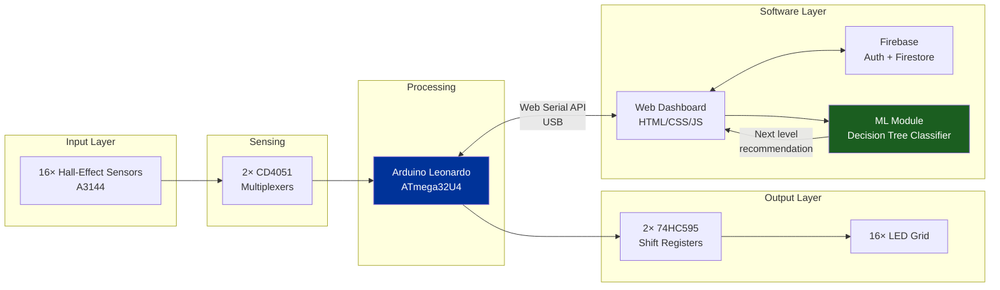
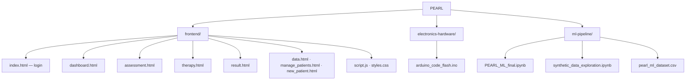

# PEARL — Physical Engagement and AI-Reviewed Learning

A hardware + software rehabilitation system that combines a Hall-effect sensor pegboard with a machine learning pipeline to guide patient therapy progression. Combines embedded systems, full-stack development, and applied ML on real clinical data.

## Overview

PEARL turns a standard pegboard into a sensor-instrumented rehabilitation tool for patients recovering motor function after stroke, TBI, or other neurological conditions. Hall-effect sensors detect peg placement in real time, LEDs give instant feedback, and a browser dashboard logs session performance. A trained classifier recommends whether a patient should be promoted, maintained, or demoted to a different difficulty level, reducing manual assessment overhead for clinicians.

Built as an academic mini-project at Ramaiah Institute of Technology, Dept. of Electronics and Instrumentation Engineering (June 2026).

## System Architecture

## Repository Structure

| Folder | Contents |
|---|---|
| [`frontend/`](./frontend) | Clinical web dashboard — login, assessment, live therapy session, results, patient management |
| [`electronics-hardware/`](./electronics-hardware) | Arduino firmware — sensor scanning, LED control, therapy level logic |
| [`ml-pipeline/`](./ml-pipeline) | Classifier notebooks + clinical dataset |

## Hardware

4×4 Hall-effect sensor pegboard on an Arduino Leonardo, built for under $30 in commodity components:

- 16× A3144 Hall-effect sensors, read via 2× CD4051 8:1 multiplexers (50 Hz scan rate)
- 2× cascaded 74HC595 shift registers driving 16 independently addressable LEDs
- 6 therapy modes in firmware: free play, sequential targeting, randomized targets, memory recall, bilateral coordination, and a mixed peak-performance mode
- End-to-end sensor-to-feedback latency under 25 ms

## Frontend

Firebase-backed web app covering the full session workflow — doctor login, pre-session assessment (auto-suggests starting difficulty), live therapy view synced to hardware over the Web Serial API, post-session results with charts, and patient records management. No backend server; all logic runs client-side.

## Machine Learning Pipeline

**Goal:** predict whether a patient should be promoted, maintained, or demoted in therapy level, using session performance (accuracy, reaction time, fatigue index, per-target timing).

**Data:** Two datasets were used across development:

- **Synthetic dataset** (~1,600 samples) — generated early on to validate the modeling approach and pipeline design before real clinical data collection began.
- **Real clinical dataset** (55 samples, 11 held out for testing) — collected from actual patient rehabilitation sessions under physiotherapist supervision. The real-data sample size is currently limited by patient consent constraints, which restricts how much clinical data could be collected within the project timeline. The project is still under upgrades for more features and more real time clinical data is being collected to make the models more robust.

**Approach:**
- Feature engineering from raw session logs (18+ features: reaction time trend, fatigue index, per-target timing)
- Fixed a data leakage issue by moving SMOTE class balancing to training data only, applied after the train/test split
- Benchmarked 5 classifiers on both datasets: Decision Tree, Random Forest, SVM, KNN, Naive Bayes

**Results:**

| Dataset | Best Model | Accuracy | Macro F1 |
|---|---|---|---|
| Real clinical data (test n=11) | Decision Tree | 90.9% | 0.87 |
| Synthetic data | SVM | 89.1% | — |

The synthetic-data run served as an early sanity check that the feature set and modeling approach could separate the three classes (promote/stay/demote) before real data was available. The real-data result is the one actually deployed, but its small test set (11 samples) means the accuracy figure has real uncertainty — one misclassified sample shifts it by ~9 percentage points. As more patient consent is obtained, the dataset will grow and the evaluation will become more statistically reliable.

| Model (real data) | Test Accuracy | Macro F1 |
|---|---|---|
| **Decision Tree** | **0.91** | **0.87** |
| Random Forest | 0.82 | 0.62 |
| SVM | 0.64 | 0.47 |
| Naive Bayes | 0.64 | 0.57 |
| KNN | 0.45 | 0.24 |

## Tech Stack

**Hardware:** Arduino, embedded C++, Hall-effect sensors, multiplexers, shift registers
**Frontend:** HTML/CSS/JavaScript, Firebase (Auth + Firestore), Web Serial API
**ML:** Python, scikit-learn, pandas, matplotlib
